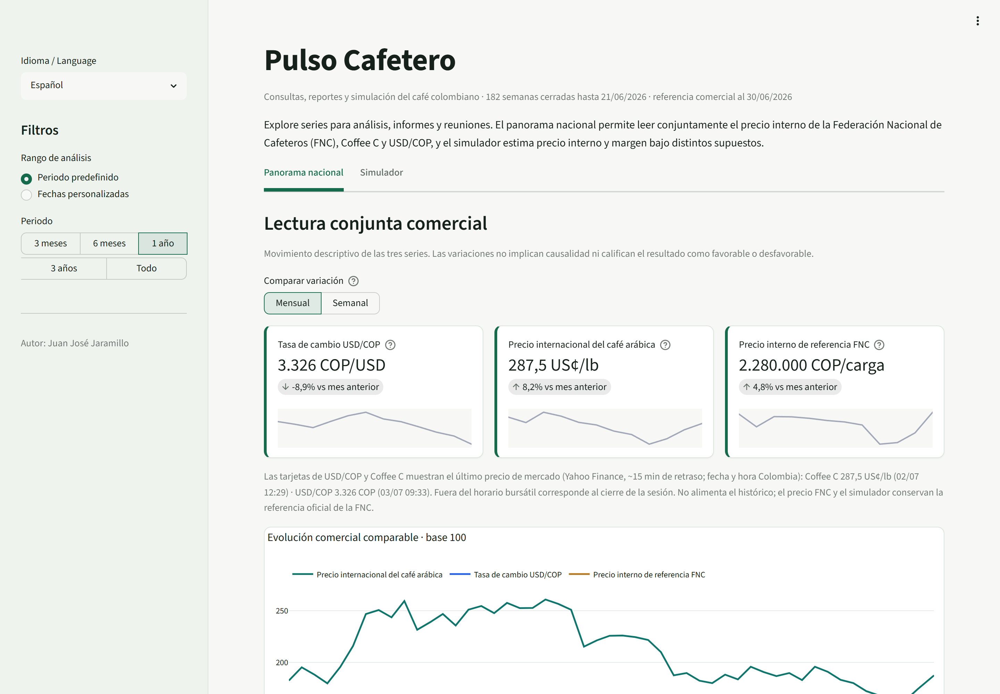
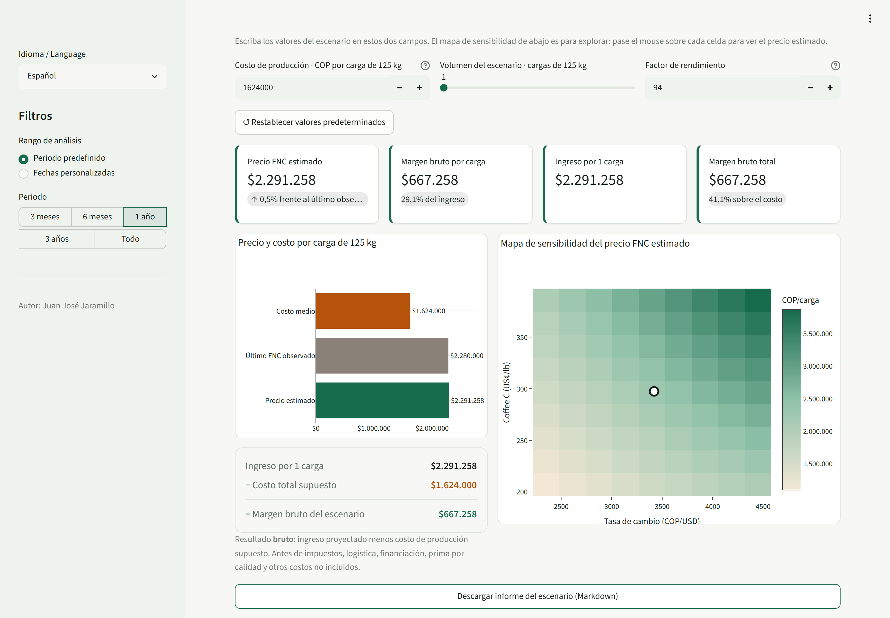

# Pulso Cafetero ☕

**Datos de mercado cafetero convertidos en evidencia lista para analizar,
presentar y descargar.**

[](https://github.com/juanjosejaramillozarate-png/Monitor_Agro_Python/actions/workflows/pruebas.yml)
[](https://github.com/juanjosejaramillozarate-png/Monitor_Agro_Python/actions/workflows/actualizar-datos.yml)

[](https://kitconsultayreporte.streamlit.app/)

[Abrir la aplicación](https://kitconsultayreporte.streamlit.app/) ·
[Ver las decisiones de producto](#decisiones-de-producto-y-análisis) ·
[Ejecutar localmente](#ejecución-local)

> **EN — Coffee Pulse** is a bilingual (ES/EN) data tool that turns Colombian
> coffee market data into reusable evidence: it integrates ICE Coffee C,
> USD/COP, the FNC internal reference price and national production/exports
> since 2023, with near-real-time market prices (~15 min delay), downloadable
> Excel workbooks, a bilingual PDF brief and a price/margin scenario
> simulator. Built with Python, pandas, Streamlit and GitHub Actions;
> 76 offline unit tests and automated data refresh on business days.

*(Nombre del repositorio: `Monitor_Agro_Python`, el nombre de trabajo original
del proyecto; la marca actual del producto es **Pulso Cafetero**.)*

## El problema

Preparar un análisis del sector cafetero exige buscar series en varias fuentes,
limpiarlas, comprobar fechas y unidades y volver a construir las gráficas para
cada informe o reunión. Pulso Cafetero reduce ese trabajo al reunir el
precio Coffee C, USD/COP, precio interno de referencia FNC, producción y
exportaciones nacionales en una sola aplicación.

El proyecto fue concebido por **Juan José Jaramillo**, estudiante de Negocios
Internacionales y analista de datos autodidacta, como puente entre comercio
internacional, análisis de datos y necesidades reales de investigación.

## La solución

- Compara Coffee C, USD/COP y precio FNC en una escala base 100.
- Redacta automáticamente una **lectura rápida del periodo** (cierre,
  variación, máximos y mínimos con fechas), lista para copiar en informes.
- Muestra la **correlación móvil** del precio FNC con Coffee C y con USD/COP
  sobre variaciones semanales, con lectura neutral y sin causalidad.
- Publica un **comentario del periodo redactado con IA (Claude)**, generado en
  la actualización automática de datos y anclado exclusivamente a cifras del
  propio kit: describe sin predecir ni recomendar, queda versionado con fecha
  y modelo, y la app no hace ninguna llamada de IA en runtime.
- Muestra el **último precio de mercado** de USD/COP y Coffee C (~15 minutos
  de retraso) junto al histórico semanal, sin mezclar proveedores en la
  calibración.
- Conserva producción y exportaciones en su cadencia mensual real.
- Descarga un libro Excel con resumen, tabla filtrable y diccionario, un CSV
  abierto listo para pandas/R, y un **brief ejecutivo en PDF de tres páginas,
  en español o inglés** según el idioma activo.
- Explora escenarios de precio interno y margen bruto mediante Coffee C,
  USD/COP, costo, volumen y factor de rendimiento, con el precio estimado
  también en COP/kg y COP/arroba.
- Funciona en español e inglés, incluidos textos, números y gráficas.

El histórico comienza en enero de 2023. El pipeline conserva además lluvia y
temperaturas de ocho departamentos cafeteros, aunque esa capa no se muestra en
la interfaz actual para mantener el foco comercial.

## Vistazo

| Panorama nacional | Simulador |
|---|---|
|  |  |

## Evidencia verificable

| Señal | Resultado |
|---|---:|
| Observaciones diarias normalizadas | 33.600+ (crecen en días hábiles) |
| Semanas completas de mercado y clima | 181+ |
| Observaciones mensuales de producción y exportaciones | 82+ |
| Pruebas unitarias sin internet | 76 |
| Actualización automática | Días hábiles |
| Salidas reutilizables | Excel, CSV, PDF (ES/EN) y Markdown |
| Idiomas | Español e inglés |

La automatización fue validada en un runner real de GitHub Actions: actualiza
los datos, recalcula los derivados, crea un commit solo si hay cambios y activa
el redespliegue en Streamlit Community Cloud.

## Impacto y validación

La herramienta está siendo probada con una directora de investigación del
sector cafetero mediante una tarea real. Los resultados y la reseña se
publicarán únicamente cuando termine la prueba y la participante apruebe de
forma explícita el texto, su nombre, cargo y afiliación.

La validación registra la tarea, el entregable, las partes utilizadas, el
resultado reutilizado, el trabajo evitado y las mejoras solicitadas. No implica
patrocinio, adopción ni aval institucional.

## Decisiones de producto y análisis

- **Cadencia honesta:** mercado y clima usan semanas cerradas; producción y
  exportaciones aparecen solo en los meses publicados.
- **Estimación, no pronóstico:** el simulador explora supuestos con el último
  trío coherente FNC/Coffee C/TRM y una calibración de respaldo.
- **Sin score prematuro:** no se califica oportunidad o riesgo sin calendario
  productivo, costos y conocimiento experto suficientes.
- **Trazabilidad visible:** las descargas conservan fecha, unidad, fuente,
  alcance y limitaciones.
- **Foco antes que funciones:** la vista climática salió de la interfaz tras el
  feedback inicial; el pipeline permanece disponible.

## Arquitectura y stack

```text
fuentes/  -> contratos estables por fuente (descarga FNC compartida y cacheada)
procesar/ -> calidad, histórico, indicadores, visualización y escenarios
reporte/  -> brief Markdown, informe del simulador, Excel y PDF bilingüe
datos/    -> histórico, indicadores, metadatos y snapshots
tests/    -> 76 pruebas unitarias sin internet (CI en cada push)
app.py    -> interfaz Streamlit bilingüe
```

Python · pandas · Plotly · Streamlit · matplotlib · reportlab · yfinance ·
Open-Meteo · GDELT · GitHub Actions · Claude API (Anthropic).

## Ejecución local

Requiere Python 3.13+.

```powershell
git clone https://github.com/juanjosejaramillozarate-png/Monitor_Agro_Python.git
cd Monitor_Agro_Python
python -m venv .venv
.\.venv\Scripts\Activate.ps1        # Windows · en Linux/macOS: source .venv/bin/activate
pip install -r requirements.txt
python main.py                       # verifica los contratos de las fuentes
streamlit run app.py                 # abre el tablero en localhost:8501
```

Para comprobar la lógica sin depender de internet (76 pruebas, también corren
en CI en cada push):

```powershell
python -m unittest discover -s tests -v
```

## Cómo actualizar el histórico

La configuración predeterminada descarga desde el 1 de enero de 2023:

```powershell
python -m procesar.historico
```

También puedes elegir un rango:

```powershell
python -m procesar.historico --desde 2025-01-01 --hasta 2025-12-31
```

El proceso es idempotente: repetir un rango actualiza los registros existentes
sin duplicarlos.

## Cómo calcular indicadores

Después de actualizar el histórico, ejecuta:

```powershell
python -m procesar.indicadores
```

La terminal muestra la última semana para Caldas, Colombia y el mercado global.
Los rankings ordenan de mayor a menor valor numérico; no significan todavía
"mejor" o "peor".

## Cómo preparar datos para gráficos

```powershell
python -m procesar.visualizacion
```

Este paso agrega etiquetas legibles, orden estable, municipio de referencia,
colores y escalas comparables. No genera score ni interpreta riesgo.

## Cómo abrir las visualizaciones

```powershell
streamlit run app.py
```

Luego abre `http://localhost:8501`. El tablero tiene dos vistas (la de entrada
es `Panorama nacional`):

- `Panorama nacional`: café, USD/COP y precio interno en una escala base 100,
  producción y exportaciones mensuales, diferencia entre ambos flujos, descarga
  de series en Excel y brief del periodo en PDF.
- `Simulador`: escenarios de precio interno y margen al modificar Coffee C,
  USD/COP, costo medio, número de cargas y factor de rendimiento; el escenario se
  fija con los controles y el mapa de sensibilidad es de solo lectura para
  explorar, con botón de restablecer e informe del escenario descargable.
Esta es una versión para feedback. El simulador no es un pronóstico y el
tablero no contiene score ni semáforos de riesgo.

## Actualización automática

`.github/workflows/actualizar-datos.yml` corre en GitHub Actions de lunes a
viernes (10:00 UTC), siguiendo el ritmo de publicación diaria de la FNC, y
también a mano (`workflow_dispatch`). Refresca una ventana reciente
del histórico de forma idempotente, recalcula indicadores y visualización, y hace
commit/push solo si hay datos nuevos. Ese push redespliega la app en Streamlit
Community Cloud, así que los datos se actualizan sin intervención. Los pasos de
datos toleran fallos puntuales de las fuentes (scraping/yfinance).

La misma corrida redacta el **comentario del periodo con Claude**
(`python -m reporte.comentario_ia`): recibe únicamente cifras exactas ya
calculadas del histórico (grounding), el prompt le prohíbe predecir o
recomendar, y el resultado queda versionado en `datos/comentario/` con fecha y
modelo. La API key vive solo como secret del repositorio (`ANTHROPIC_API_KEY`);
la app pública no hace ninguna llamada de IA, así que el costo no depende del
número de visitantes (~20 llamadas al mes, una por día hábil).

## Archivos de resultados

- `datos/historico/historico_diario.csv`: observaciones originales normalizadas.
- `datos/historico/historico_semanal.csv`: semanas comparables, listas para
  tendencias y gráficos; producción y exportaciones conservan únicamente sus
  meses publicados.
- `datos/indicadores/indicadores_semanales.csv`: capa derivada completa.
- `datos/indicadores/resumen_ultima_semana.csv`: vista compacta de la última
  semana disponible.
- `datos/visualizacion/series_visualizacion.csv`: series listas para
  gráficos; es derivado y se regenera con el comando anterior.
- `datos/visualizacion/resumen_visual.csv`: última semana con metadatos.
- `datos/visualizacion/catalogo_variables.csv`: etiquetas, descripciones,
  colores y formatos de las nueve variables.
- `datos/snapshots/`: fotografías archivadas de las ejecuciones semanales.
- `datos/comentario/comentario_periodo.json`: comentario del periodo redactado
  con Claude en CI, bilingüe y con fecha y modelo para trazabilidad.

La semana se cierra el domingo. Café, USD/COP y precio FNC usan el último dato
disponible de la semana. La lluvia se suma y las temperaturas se agregan a
mínimo, máximo y promedio.

## Cobertura geográfica

Huila, Antioquia, Tolima, Cauca, Nariño, Caldas, Risaralda y Quindío. El clima
de cada departamento usa por ahora una coordenada municipal representativa,
definida en `config.py`; no representa toda la variación interna departamental.

## Autoría y créditos

Diseñado y desarrollado por **Juan José Jaramillo**. El diseño del producto,
las decisiones de análisis, la selección de fuentes y la validación son
propios. Parte del desarrollo contó con asistencia de IA (Claude Code) para
revisión de código, pruebas y documentación.

## Licencia

© 2026 Juan José Jaramillo. **Todos los derechos reservados.**

Este repositorio es público solo con fines de evaluación y muestra de
portafolio. No se permite copiar, modificar, reutilizar ni redistribuir el
código sin autorización previa y por escrito del autor. Ver [LICENSE](LICENSE).
